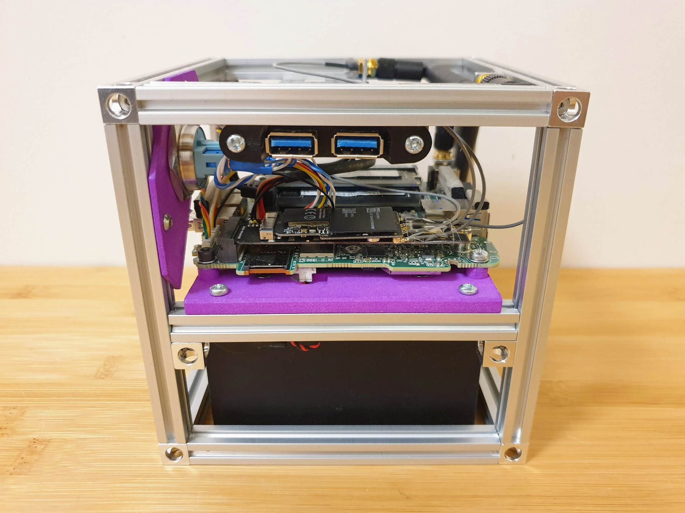
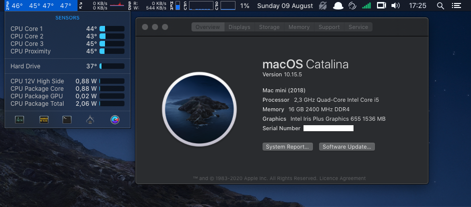
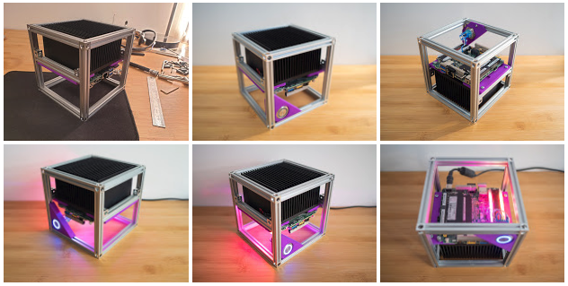
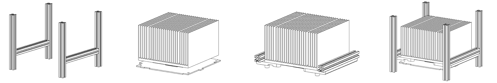

# My Hackintosh



My current build runs macOS Monterey 12.1x? and is based on a fanless Intel [NUC8i5BEK](https://ark.intel.com/content/www/us/en/ark/products/126147/intel-nuc-kit-nuc8i5bek.html) with a [i5-8259U CPU](https://ark.intel.com/content/www/us/en/ark/products/135935/intel-core-i58259u-processor-6m-cache-up-to-3-80-ghz.html).

## What works, what does not

- ✅ GPU acceleration
- ✅ HDMI audio
- ✅ HDMI and USB-C video at 2560 x 1440 @ 60 Hz
- ✅ USB2 / USB3 / USB-C
- ✅ SATA storage
- ✅ WiFi WLAN + Bluetooth in M.2 slot
- ❔ Front panel audio: sounds is unbalanced and weird
- ❔ SD card reader: haven't tested
- ❔ Other display resolutions: not tested
- ❌ Sleep/wake: Doesn't work
- ❌ Built in WLAN/Bluetooth: It is [apparently possible but not perfect](https://github.com/OpenIntelWireless/itlwm)

## Hackintosh details



Runs OpenCore 0.7.5:

- [config.plist](EFI/OC/config.plist)
- [EFI](EFI) directory

## Photos

[](img)

## Hardware

### Specs

- Intel Core i5-8259U CPU (built in)
- Intel Iris Plus Graphics 655 (built in)
- 16GB RAM F4-2400C16D-16G
- Kingston KC600 512GB mSATA SSD (with mSATA adapter)
- Broadcom BCM94360CD WiFi WLAN + Bluetooth 4.0 (with M.2 NGFF Adapter Card)
- Alpine AM4 Passive CPU cooler, required some machining to fit
- Makerbeam open case structure
- Custom 3D printed CPU mounting brackets
- Custom 3D printed power switch bracket

### Power consumption and temperatures

Power measured at wall, temperature measured from built in sensors.

| State                                        | Power (watts) | CPU temp (°C) |
|----------------------------------------------|---------------|---------------|
| Powered off                                  | 0.9           | 0             |
| Booted OS, idle                              | 4-6           | 34            |
| Normal use with Chrome, AutoCAD, Spotify etc | 10-20         | 40-70         |
| Prime95 or stress                            | 44            | 94            |

### CAD files

[](#)

Fusion 360 project file, Heatsink bracket STL and Switch bracket STL files are in: [cad-files](cad-files)

## OpenCore setup process

Download OpenCore release and other required files:

```
# Save into separate directory
cd downloads

# Get Nucintosh release
wget https://github.com/zearp/Nucintosh/releases/download/v3.1/EFI_05112021.zip

# Get OpenCore release
wget https://github.com/acidanthera/OpenCorePkg/releases/download/0.7.5/OpenCore-0.7.5-RELEASE.zip

# Get others
wget https://github.com/acidanthera/OcBinaryData/raw/master/Drivers/HfsPlus.efi
wget https://github.com/acidanthera/VirtualSMC/releases/download/1.2.7/VirtualSMC-1.2.7-RELEASE.zip
wget https://github.com/acidanthera/Lilu/releases/download/1.5.7/Lilu-1.5.7-RELEASE.zip
wget https://github.com/acidanthera/WhateverGreen/releases/download/1.5.5/WhateverGreen-1.5.5-RELEASE.zip
wget https://github.com/acidanthera/AppleALC/releases/download/1.6.6/AppleALC-1.6.6-RELEASE.zip
wget https://github.com/acidanthera/IntelMausi/releases/download/1.0.7/IntelMausi-1.0.7-RELEASE.zip
wget https://github.com/acidanthera/BrcmPatchRAM/releases/download/2.6.1/BrcmPatchRAM-2.6.1-RELEASE.zip
wget https://github.com/acidanthera/NVMeFix/releases/download/1.0.9/NVMeFix-1.0.9-RELEASE.zip

# Get required SSDTs
wget https://github.com/dortania/Getting-Started-With-ACPI/raw/master/extra-files/compiled/SSDT-AWAC.aml
wget https://github.com/dortania/Getting-Started-With-ACPI/raw/master/extra-files/compiled/SSDT-PMC.aml
```

Extract all zip files in `downloads`.

Now build our initial EFI directory based on OpenCore release, [Nucintosh](https://github.com/zearp/Nucintosh) SSDTs and `config.plist`:

```
rm -rf EFI
cp -a downloads/OpenCore-0.7.5-RELEASE/X64/EFI .
```

Clean it up:

```
cp EFI/OC/Drivers/OpenRuntime.efi .
rm -f EFI/OC/Drivers/*
mv OpenRuntime.efi EFI/OC/Drivers/
cp EFI/OC/Tools/OpenShell.efi .
rm -f EFI/OC/Tools/*
mv OpenShell.efi EFI/OC/Tools/
```

Add other required files and kexts:

```
cp downloads/HfsPlus.efi EFI/OC/Drivers/
cp -a downloads/Lilu-1.5.7-RELEASE/Lilu.kext EFI/OC/Kexts/
cp -a downloads/VirtualSMC-1.2.7-RELEASE/Kexts/SMCProcessor.kext EFI/OC/Kexts/
cp -a downloads/VirtualSMC-1.2.7-RELEASE/Kexts/SMCSuperIO.kext EFI/OC/Kexts/
cp -a downloads/VirtualSMC-1.2.7-RELEASE/Kexts/VirtualSMC.kext EFI/OC/Kexts/
cp -a downloads/WhateverGreen-1.5.5-RELEASE/WhateverGreen.kext EFI/OC/Kexts/
cp -a downloads/AppleALC-1.6.6-RELEASE/AppleALC.kext EFI/OC/Kexts/
cp -a downloads/IntelMausi-1.0.7-RELEASE/IntelMausi.kext EFI/OC/Kexts/
cp -a downloads/BrcmPatchRAM-2.6.1-RELEASE/BlueToolFixup.kext EFI/OC/Kexts/
```

Add SSDTs:

```
cp downloads/*.aml EFI/OC/ACPI/
```

Get `config.plist` and SSDTs from [Nucintosh](https://github.com/zearp/Nucintosh) release:

```
cp downloads/EFI/OC/config.plist EFI/OC/config.plist
cp downloads/EFI/OC/ACPI/*.aml EFI/OC/ACPI/
```

Then make some manual changes to `config.plist`:

- Remove `IntelBluetooth`
- Remove `cpufriend`

Edit `config.plist` with [GenSMBIOS](https://github.com/corpnewt/GenSMBIOS) to update the fields:

- MLB
- ROM
- SystemSerialNumber
- SystemUUID

Now copy [EFI](EFI) directory to your USB drive and install macOS Monterey.

## Credits

- https://github.com/zearp/Nucintosh
