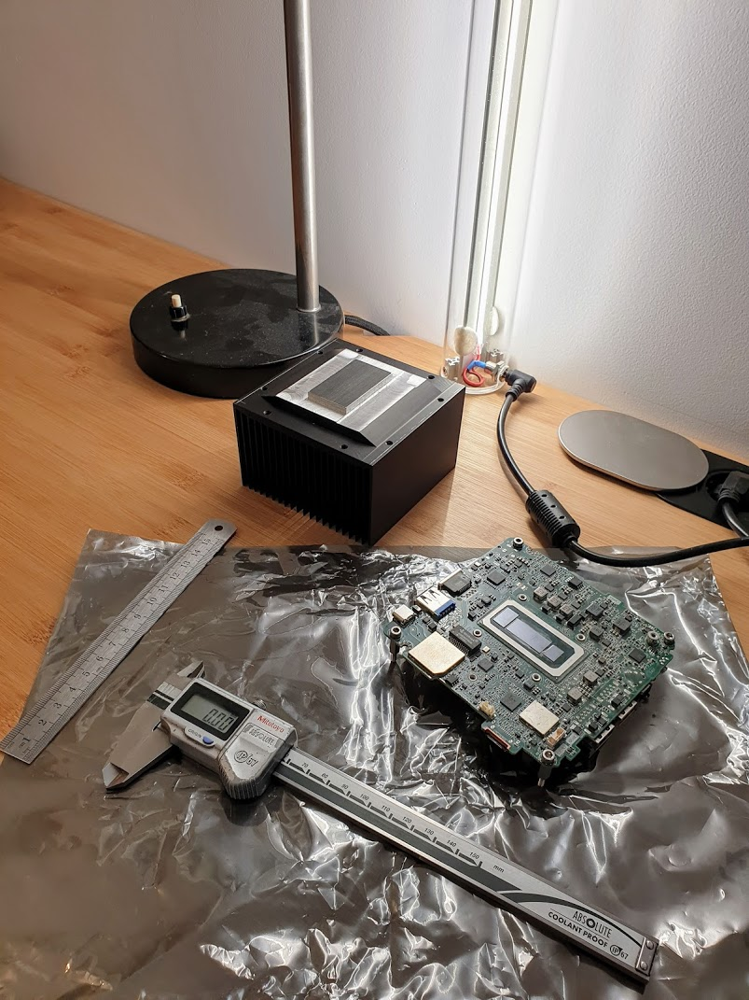
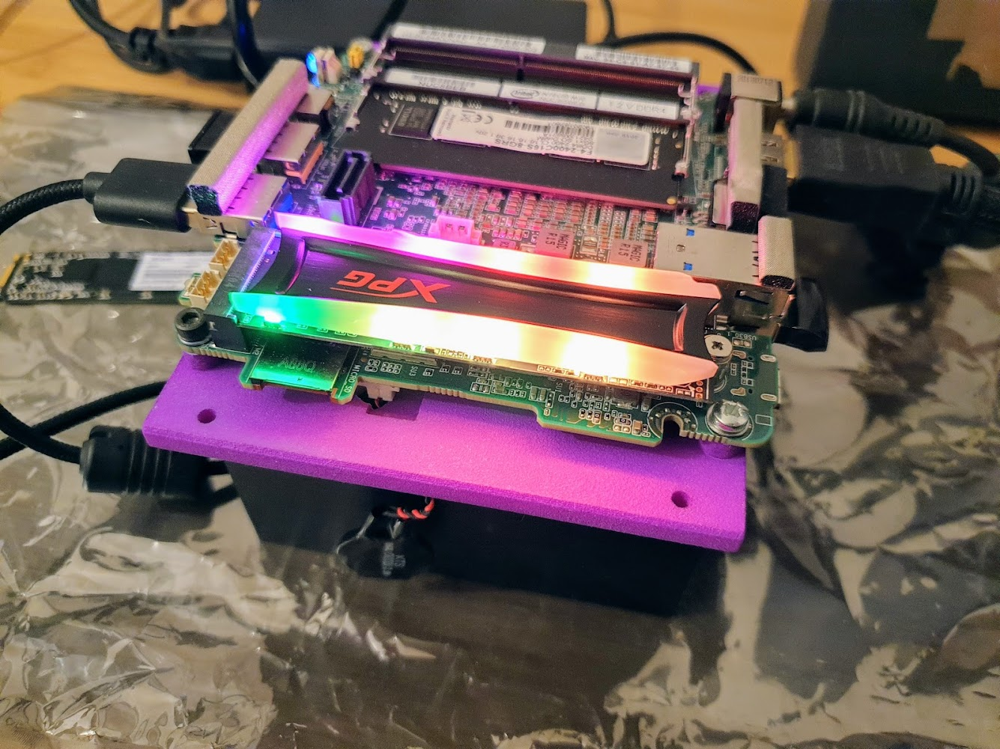

# My Hackintosh

macOS version: El Capitan
Motherboard: Asus Z97I-Plus (mini-ITX)
CPU: Intel core i3-4150 (2C/4T, 35W TDP)
Cooler: Nofan CR-80EH
PSU: Pico PSU
Other parts: M2 SSD underneath motherboard, Samsung EVO SSD, 8GB RAM
Case: Custom made using [Makerbeam](https://www.makerbeam.com/)

## What works, what does not

- ✅ GPU acceleration
- ✅ HDMI audio
- ✅ HDMI video
- ✅ USB2 / USB3
- ✅ Front panel audio
- ✅ WLAN/Bluetooth
- ? Sleep/wake (sometimes works, sometimes not)

## More photos

### Temperatures

32°C idle, 59°C load.
